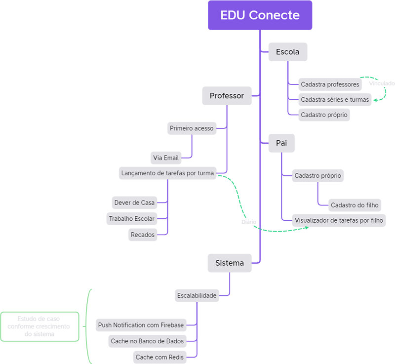

<!-- markdownlint-disable MD033 MD036 MD041 MD014 -->
<p align="center">
  <br><br>
  
  &nbsp;&nbsp;
  
</p>
<br>
<br>

<h1 align="center">EDU Conecte</h1>
<p align="center">🕮 Aproximando os pais no acompanhamento escolar dos filhos</p>
<br>

**💻 Desafio DoWhile2021 - FortBrasil / Parceria Rocketseat 🚀**

## Sumário

- [Sumário](#sumário)
- [Descrição](#descrição)
  - [🔥 Desafio](#-desafio)
  - [💡 Solução](#-solução)
    - [Breve Explanação](#breve-explanação)
    - [Atacando parte do Problema](#atacando-parte-do-problema)
    - [Esquemático geral](#esquemático-geral)
- [Instalação](#instalação)
- [Iniciando servidor](#iniciando-servidor)
  - [Container banco de dados MySQL com Adminer](#container-banco-de-dados-mysql-com-adminer)
  - [Servidor de Aplicação](#servidor-de-aplicação)
- [Testes](#testes)
- [Licença de uso](#licença-de-uso)


## Descrição

### 🔥 Desafio

> "Pensando em construir o futuro, como você solucionaria os problemas de acesso à educação hoje, utilizando a tecnologia?"

### 💡 Solução

#### Breve Explanação

Os problemas com a educação brasileira já são reconhecidos de décadas. Poucos avanços são notados quando leva em consideração a classe mais pobre, aquela que depende diretamente dos serviços públicos.  
Do desinteresse na grade curricular à falta de acompanhamento dos pais, da formação dos professores à falta de infraestrutura, sofremos desde problemas culturais à falta de atenção do governo.  

#### Atacando parte do Problema

A rotina diária dos pais por vezes não ajuda o acompanhamento dos filhos nas atividades solicitadas pelas escolas. Pensando em construir o futuro, minha ideia é contribuir com parte da solução, facilitando para os pais um acompanhamento pós aula mais eficiente.

#### Esquemático geral

<br>
<p align="center">
  
</p>
<br>

## Instalação

```bash
  $ npm install
```

## Iniciando servidor

### Container banco de dados MySQL com Adminer

```bash
# Docker
$ docker-compose up -d
```

MySQL [https://localhost:3306](https://localhost:3306)

Adminer [https://localhost:8080](https://localhost:8080)

### Servidor de Aplicação

```bash
  # development
  $ npm run start

  # watch mode - hot reload
  $ npm run start:dev

  # production mode
  $ npm run start:prod
```

## Testes

```bash
# unit tests
$ npm run test

# e2e tests
$ npm run test:e2e

# test coverage
$ npm run test:cov
```

## Licença de uso

[MIT](LICENSE).
