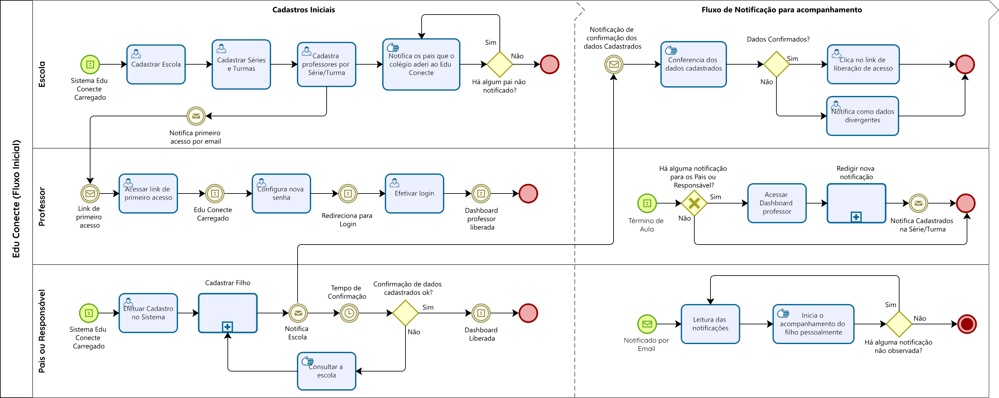
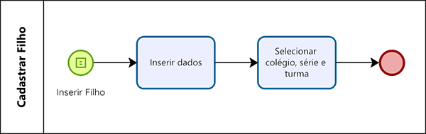
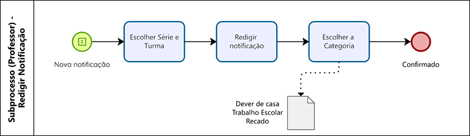

<!-- markdownlint-disable MD033 MD036 MD041 MD014 -->
<p align="center">
  <br><br>
  
  &nbsp;&nbsp;
  
</p>
<br>
<br>

<h1 align="center">EDU Conecte</h1>
<p align="center">🕮 Aproximando os pais no acompanhamento escolar dos filhos</p>
<br>

<p align="center">


<br>


</p>
<br>
**💻 Desafio DoWhile2021 - FortBrasil / Parceria Rocketseat 🚀**

## Sumário

- [Sumário](#sumário)
- [Descrição](#descrição)
  - [🔥 Desafio](#-desafio)
  - [💡 Solução](#-solução)
    - [Introdução](#introdução)
    - [Atacando parte do Problema](#atacando-parte-do-problema)
    - [Resolução](#resolução)
    - [Esquemático geral](#esquemático-geral)
    - [Mapeamento dos processos](#mapeamento-dos-processos)
      - [Detalhamento de fluxo](#detalhamento-de-fluxo)
      - [Subprocessos - Cadastrar filho](#subprocessos---cadastrar-filho)
      - [Subprocesso - Redigir notificação](#subprocesso---redigir-notificação)
- [Status da Aplicação](#status-da-aplicação)
- [Instalação](#instalação)
- [Iniciando servidor](#iniciando-servidor)
  - [Clone da Aplicação](#clone-da-aplicação)
  - [Container banco de dados MySQL com Adminer](#container-banco-de-dados-mysql-com-adminer)
  - [Servidor da Aplicação](#servidor-da-aplicação)
- [Testes](#testes)
- [Licença de uso](#licença-de-uso)

## Descrição

### 🔥 Desafio

> "Pensando em construir o futuro, como você solucionaria os problemas de acesso à educação hoje, utilizando a tecnologia?"

### 💡 Solução

#### Introdução

Os problemas com a educação brasileira já são reconhecidos de décadas. Poucos avanços são notados quando leva em consideração a classe mais pobre, aquela que depende diretamente dos serviços públicos.  
Do desinteresse na grade curricular à falta de acompanhamento dos pais, da formação dos professores à falta de infraestrutura, sofremos desde problemas culturais à falta de atenção do governo.  

#### Atacando parte do Problema

A rotina diária dos pais por vezes não ajuda o acompanhamento dos filhos nas atividades solicitadas pelas escolas. Pensando em construir o futuro, minha ideia é contribuir com parte da solução, facilitando para os pais um acompanhamento pós aula diariamente mais eficiente.

#### Resolução

Essa solução tecnológica implenta de forma mais simples possível uma comunicação direta do professor para com os pais dos alunos que leciona. Através de notificações o professor poderá ao final de cada aula regitrar notas no EDU Conecte(sistema) selecionando a turma, série e categoria da nota que automaticamente após registrado o sistema notificará os pais por email.  
Exemplo:  
  -- Nota do professor de matemática: "Dever de casa, livro Saber matemática pág. 56, exercicios." | Prazo final: 10/3/2022.  

#### Esquemático geral

<br>
<p align="center">
  
</p>
<br>

#### Mapeamento dos processos

*Para melhor visualização clicar na imagem ou fazer o download da mesma.*

##### Detalhamento de fluxo

<p align="center">
  
</p>
<br>

##### Subprocessos - Cadastrar filho

<p align="center">
  
</p>
<br>

##### Subprocesso - Redigir notificação

<p align="center">
  
</p>
<br>

## Status da Aplicação

🚧 Novas funcionalidades 🚀 em construção... 🚧

## Instalação

```bash
  $ npm install
```

## Iniciando servidor

### Clone da Aplicação

```bash
# Download do projeto
$ git clone https://github.com/Douglas-Morais/edu-conecte.git

# Entrando na página do projeto
$ cd edu-conecte

# Abra com o editor de sua preferência (ex. VSCode)
$ code .
```

### Container banco de dados MySQL com Adminer

```bash
# Subindo os Containers da aplicação
$ docker-compose up -d
```

MySQL [https://localhost:3306](https://localhost:3306)

Adminer [https://localhost:8080](https://localhost:8080)

### Servidor da Aplicação

```bash
  # development
  $ npm run start

  # watch mode - hot reload
  $ npm run start:dev

  # production mode
  $ npm run start:prod
```

## Testes

```bash
# unit tests
$ npm run test

# e2e tests
$ npm run test:e2e

# test coverage
$ npm run test:cov
```

## Licença de uso

[MIT](LICENSE).
